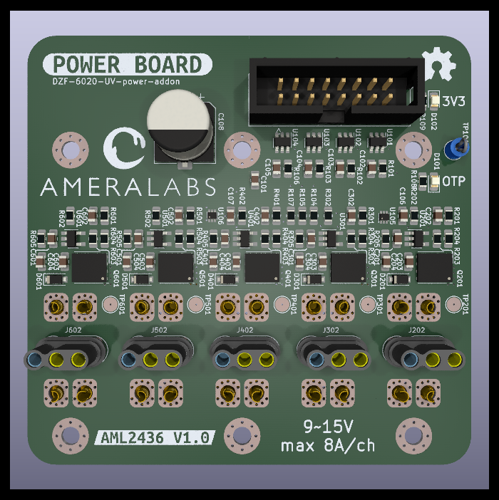

# DZF-6020-UV-power-addon
Addon for DZF-6020 vacuum UV post-curing chamber to adjust light sources and their radiant flux.

Dev NOTE: before commit, run `./kibot.sh` to regenerate documentation, bom, gerbers and other assets.

* [schematics.pdf](gen/schematics.pdf)
* [pcb.pdf with dimensions](gen/pcb.pdf)
* [ibom.html](gen/pwr_single/ibom.html)

