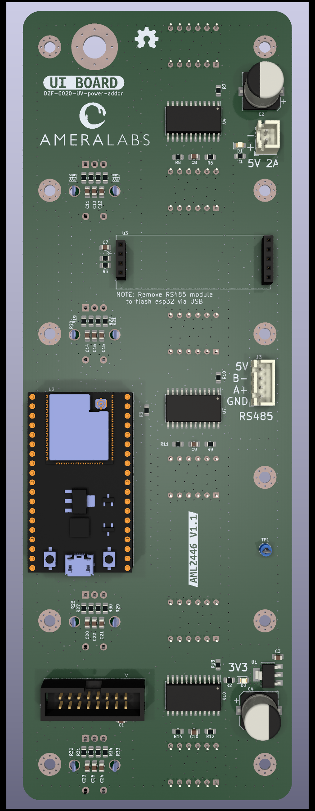
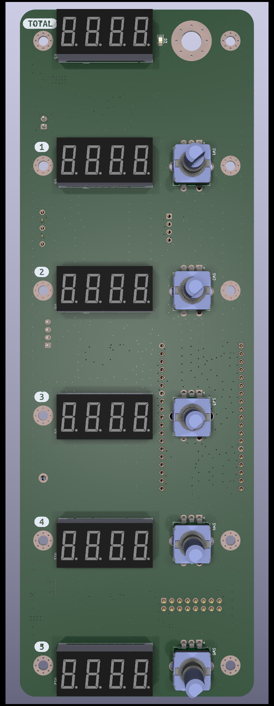
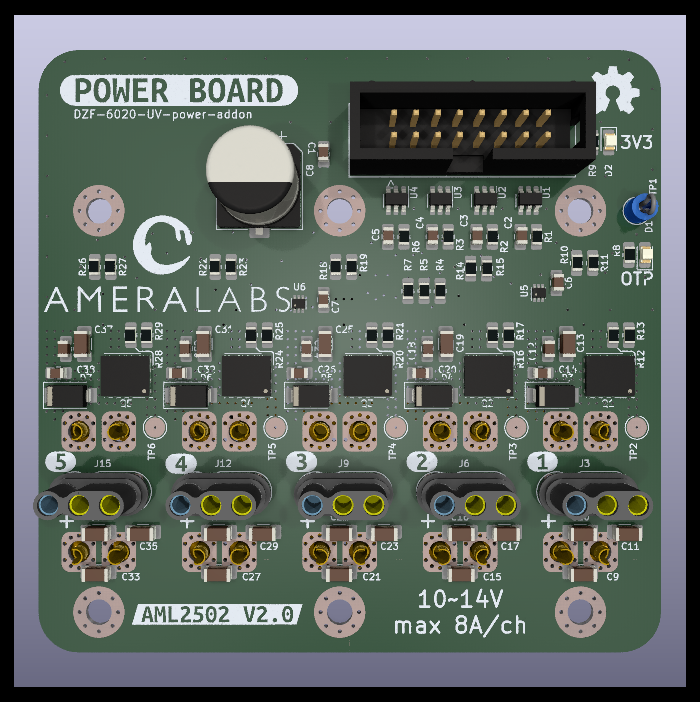

# DZF-6020-UV-power-addon
Addon for DZF-6020 vacuum UV post-curing chamber to adjust light sources and their radiant flux.

---

Dev NOTE: before commit, run `./kibot.sh` to regenerate documentation, bom, gerbers and other assets.

* [UI schematics](gen/schematics_ui.pdf)
* [power schematics](gen/schematics_pwr.pdf)
* [pcb.pdf with dimensions](gen/pcb.pdf)

